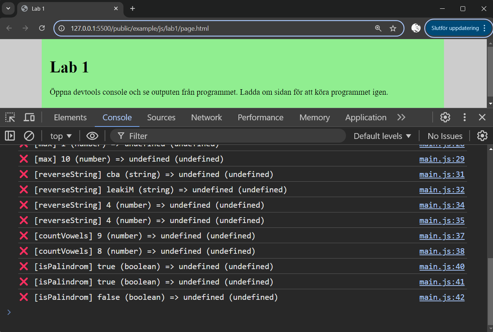

Programmera grunderna i JavaScript
===========================

I denna övningen får du träna på att programmera med grunderna i programmeringsspråket JavaScript med siffor boolean, strängar och arrayer samt loopar och if-satser.

[[_TOC_]]

<!--
TODO

* string
    * replaceSpaces
    * capitalizeWords
    * countCharacter (vilket tecken förekommer mest)
-->


Förutsättning
---------------------------

Du kan grunderna i minst ett annat programmeringsspråk och du kan grunderna i hur JavaScript samverkar med en webbsida.


Förberedelser
---------------------------

Förbered dig så här för övningen. Börja att öppna din terminal Powershell och gå till den katalog där du vill börja jobba.

Skapa nu en katalog för `lab_01`.

```
mkdir lab_01
cd lab_01
```

Nu skall vi hämta fyra filer från nätet som behövs för att komma igång med labben. Skriv följande kommandon i powershell.

```
curl -sS -o lab.html https://raw.githubusercontent.com/webtec-2024/website/refs/heads/main/src/content/docs/laromaterial/labb/lab_01/lab.html
curl -sS -o main.js https://raw.githubusercontent.com/webtec-2024/website/refs/heads/main/src/content/docs/laromaterial/labb/lab_01/main.js
curl -sS -o lab.js https://raw.githubusercontent.com/webtec-2024/website/refs/heads/main/src/content/docs/laromaterial/labb/lab_01/lab.js
curl -sS -o module.js https://raw.githubusercontent.com/webtec-2024/website/refs/heads/main/src/content/docs/laromaterial/labb/lab_01/module.js
```

När du är klar kan det se ut så här.

```
PS C:\Users\mos\webbutveckling2\lab1> ls


    Directory: C:\Users\mos\webbutveckling2\lab1


Mode                 LastWriteTime         Length Name
----                 -------------         ------ ----
-a----         10/2/2024   1:38 PM           1826 main.js
-a----         10/2/2024   1:38 PM           4028 module.js
-a----         10/2/2024   1:38 PM            385 page.html
-a----         10/2/2024   1:38 PM            149 style.css
```

Nu kan du öppna din vscode utifrån denna katalogen.

```
code .
```

Tittar runt i de fyla filerna som finns i labben och försök förstå hur de händer ihop. 

Öppna webbsidan `page.html` i din webbläsare via LiveServer.

Öppna din dev tools och fliken console. Här kan du exekvera hela labben och du får status utskriven.

Det kan se ut så här.



I filen `module.js` finns alla övningsuppgifter som du skall utföra i form av funktioner som skall implementeras. Varje gång du implementerar en funktion så kan du ladda om webbsidan för att se om det blir grönt eller rött.

Det som visas i devtools console är utskriften från `main.js` och det är tester som körs mot de funktioner som du skall implementera.


Första övningsuppgiften
---------------------------

I den första övningsuppgiften skall du implementera följande funktion.

```js
/**
 * Returns the string "Hello world".
 *
 * @returns {string} A welcome message "Hello world".
 */
export function hello () {
    // TODO: Write your code here.
}
```

När du är klar med din implementation så kan du ladda om din webbsida och se om det blev grönt.

<details>
<summary>Lösningsförslag</summary>

```js
/**
 * Returns the string "Hello world".
 *
 * @returns {string} A welcome message "Hello world".
 */
export function hello () {
    // TODO: Write your code here.
    return "Hello world";
}
```

</details>


Provkör en funktion i devtools
---------------------------

Ibland vill man provköra sina egna funktioner i devtools. Du kan göra det på detta viset.

Importera modulen så den blir tillgänglig i devtools console.

```js
const module = await import('./module.js')
```

Nu har du den tillgänglig och kan anropa en metod som ligger i modulen.

```js
module.hello()
```

Nu kan du implementera funktionerna, samtidigt som du kan testköra dem.
